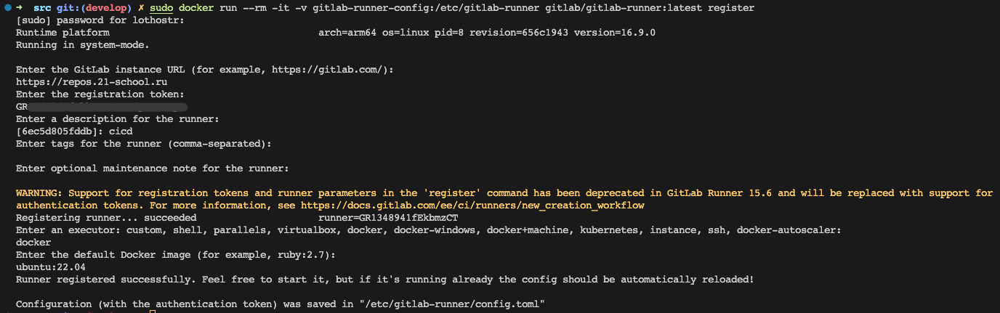

# CI: Настройка GitLab Runner в Docker

## Установка Docker

```zsh
sudo apt update
```
> Обновите индекс пакетов APT.

```zsh
sudo apt install apt-transport-https ca-certificates curl gnupg lsb-release
```
> Установите необходимые зависимости.

```zsh
curl -fsSL https://download.docker.com/linux/ubuntu/gpg | sudo gpg --dearmor -o /usr/share/keyrings/docker-archive-keyring.gpg
```
> Добавьте официальный ключ GPG Docker.

```zsh
# amd64
echo "deb [arch=amd64 signed-by=/usr/share/keyrings/docker-archive-keyring.gpg] https://download.docker.com/linux/ubuntu $(lsb_release -cs) stable" | sudo tee /etc/apt/sources.list.d/docker.list > /dev/null

# arm64
echo "deb [arch=arm64 signed-by=/usr/share/keyrings/docker-archive-keyring.gpg] https://download.docker.com/linux/ubuntu \
$(lsb_release -cs) stable" | sudo tee /etc/apt/sources.list.d/docker.list > /dev/null
```
> Официальный репозиторий Docker в список источников пакетов.

```zsh
sudo apt update
```
> Обновите индекс пакетов APT, снова.

```zsh
sudo apt install docker-ce docker-ce-cli containerd.io docker-buildx-plugin docker-compose-plugin
```
> Установка Docker Engine.

```zsh
sudo usermod -aG docker $USER
```
> Docker без `sudo`.

```zsh
docker run hello-world
```
> Docker тест работы.

## Создание Docker тома

```zsh
docker volume create gitlab-runner-config
```
> Команда создает новый том (volume) в Docker с именем `gitlab-runner-config`. Тома в Docker используются для постоянного хранения данных, которые могут быть доступны и сохранены даже после остановки или удаления контейнера.

## Запуск контейнера GitLab Runner с использованием созданного тома

```zsh
docker run -d --name gitlab-runner --restart always -v /var/run/docker.sock:/var/run/docker.sock -v gitlab-runner-config:/etc/gitlab-runner gitlab/gitlab-runner:latest
```
> Эта команда запускает новый контейнер Docker с несколькими параметрами

- `-d`: Запускает контейнер в фоновом режиме (detached mode).
- `--name gitlab-runner`: Присваивает контейнеру имя `gitlab-runner`.
- `--restart always`: Гарантирует, что контейнер будет автоматически перезапускаться, если он остановится по какой-либо причине.
- `-v /var/run/docker.sock:/var/run/docker.sock`: Монтирует сокет Docker с хост-системы в контейнер. Это позволяет GitLab Runner управлять другими контейнерами Docker.
- `-v gitlab-runner-config:/etc/gitlab-runner`: Монтирует ранее созданный том `gitlab-runner-config` в папку `/etc/gitlab-runner` внутри контейнера. Это позволяет сохранять конфигурацию GitLab Runner даже после перезапуска или удаления контейнера.
- `gitlab/gitlab-runner:latest`: Имя образа, который будет использован для создания контейнера. В данном случае используется последняя версия образа GitLab Runner.

Контейнер GitLab Runner с использованием Docker тома для хранения конфигурации Runner - обеспечивает сохранность конфигурации при перезапуске или удалении контейнера.

## Регистрируем Runner

``` bash
sudo docker run --rm -it -v gitlab-runner-config:/etc/gitlab-runner gitlab/gitlab-runner:latest register
```
> После этого начинается настройка


```zsh
https://repos.21-school.ru
token
cicd


docker
ubuntu:22.04
```
> Конфигурирование.




```zsh
sudo cat /var/lib/docker/volumes/gitlab-runner-config/_data/config.toml
```
> Просмотр конфигурационного файла

[.gitlab-ci.yml](../../../.gitlab-ci.yml)
> Должен находится в корне проекта.
